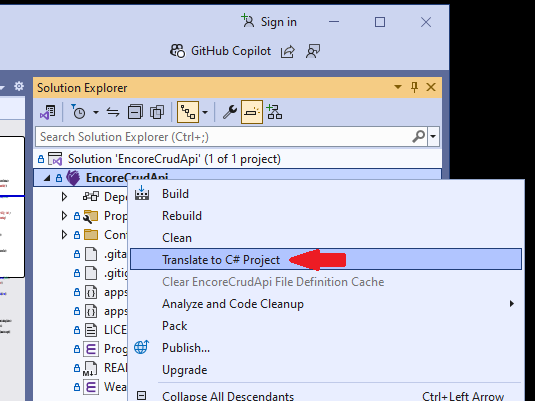
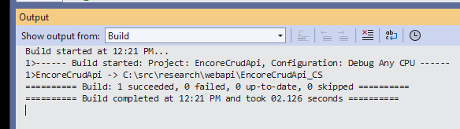
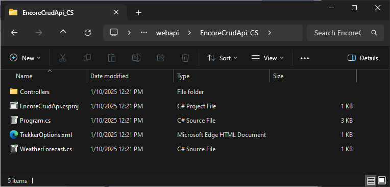
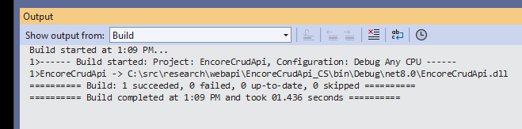
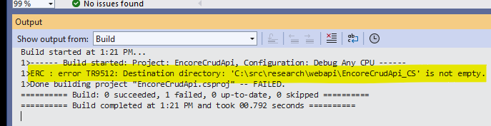
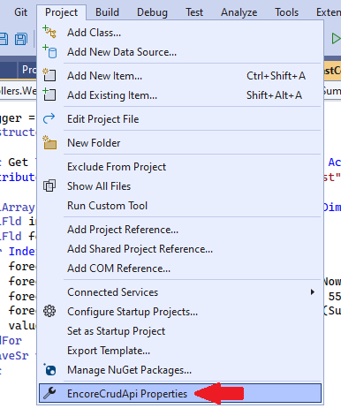
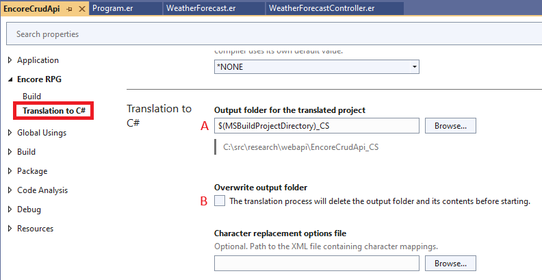
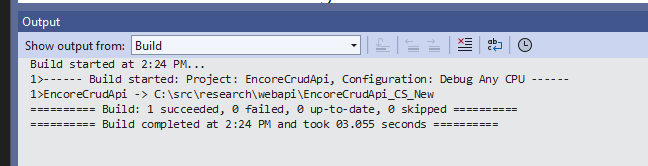

Encore RPG for Visual Studio provides a simple IDE command for generating a standalone C# project equivalent to the current Encore project. Applications produced by C# projects generated by Encore RPG are 100% functionally equivalent to the applications produced by the original Encore RPG projects. The only difference is that Encore code is replaced with C# code managed by a C# project.

> Note that C# project migration is a **one-way** operation. Thereafter, the Encore project and the derived C# project are independent, and only "in sync" until one or the other project is subsequently modified.

The Encore RPG project system provides a few options for creating C# projects, as discussed below.

* [Using the **Translate to C# Project** Command](#translate-to-c-project)
* [Project Designer Options](#project-designer-options)

---
### Translate to C# Project

1. Select the project to migrate in Solution Explorer, and Right-Click to show the context menu. Note the **Translate to C# Project** command as shown below.  Invoke the command.

    

2. The command starts a project build specifying an option to create a C# project rather than an application. The output, which displays the location of the new project, is shown in the Output window, as shown below.

    > Note that this command is implemented in Encore SDK via an [MSBuild](https://learn.microsoft.com/en-us/visualstudio/msbuild/msbuild) compiler option.

    

3. Observe the produced project files in the directory mentioned in the command output.

    

4. Open the project file (with the `.csproj` extension) in Visual Studio to use the new project. Use the **Build Solution** command on the **Build** menu (or default key shortcut `Ctrl+Shift+B`) to verify that the project builds the application successfully.

    

---
### Project Designer Options

Using the Encore project migrated in the prior section as an example, suppose some changes are made to the Encore code after the migration. Now we want to re-migrate the Encore project with those changes.

1. As in the prior section, the **Translate to C# Project** command is invoked. In this case however, build output below shows a failure, due to the presence of files in the "default" project output location.

    

    > The error can be remedied in several ways, including simply deleting the contents, or the target directory entirely from the file system then re-running the command. 

2. Instead of throwing away the prior migration, we can modify a project property to resolve this. On the **Project** menu, select **Properties** as shown below.

    

3. The .NET project "designer" appears. In the left margin, navigate to the **Encore RPG** section, and then to **Translation to C#**, as shown below. This presents two options, only one of which allows us to keep the prior migration:

    A. Change the **Output folder for the translated project** path, or

    B. Set the **Overwrite output folder** option.

    

4. Since we want to save the prior migration, change the output folder name to `$(MSBuildProjectDirectory)_CS_New` in the text box marked 'A' above, and re-run the **Translate to C# Project** command.  The output should now show a successful migration in the folder specified.

    

