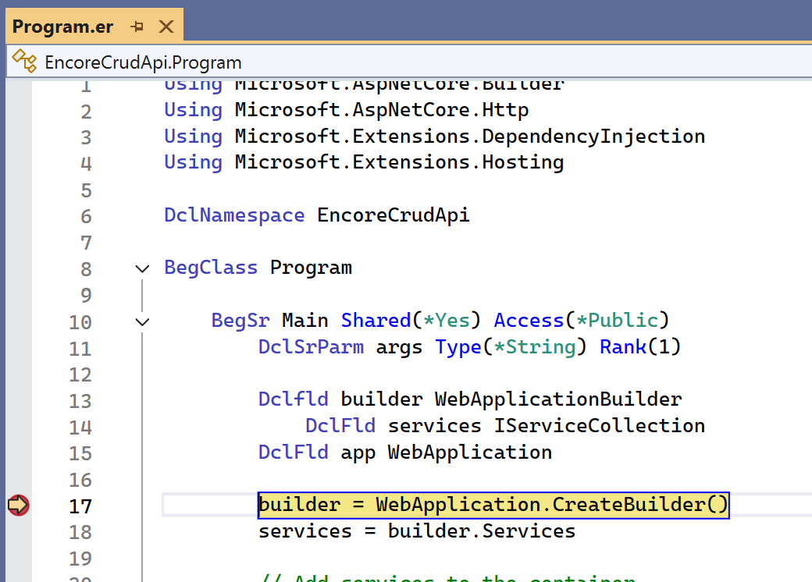
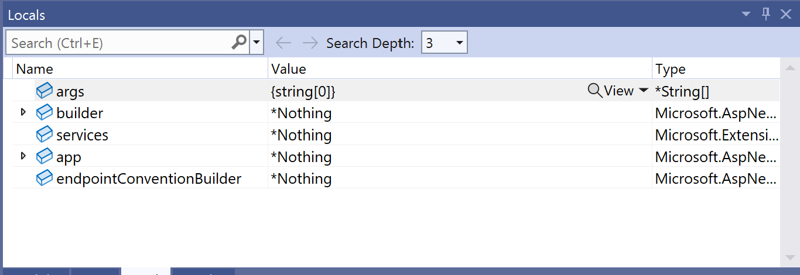
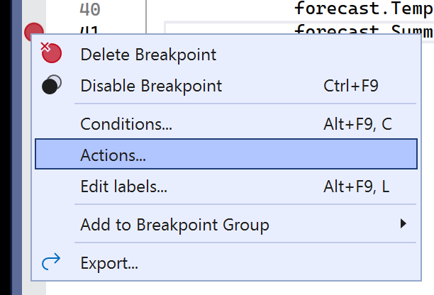
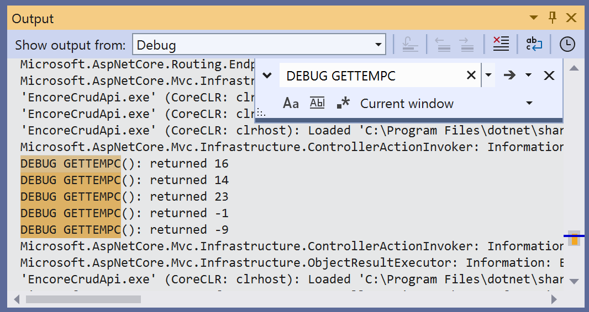

The most basic feature of any debugging experience is the ability to stop execution of running applications with breakpoints.  Visual Studio provides best-in-class breakpoint features including conditionals, toggling, tracepoints, cascades, and hit counts. Encore RPG extends these features into its IntelliSense®-enabled editor.  Below are some quick walkthroughs.

---
### Set a Breakpoint

The first question to answer when debugging with breakpoints is "where?".  If you are unsure of the location of a problem, it may be best to set a breakpoint near the beginning of the program, such as in the `BegFunc Main` method of console applications, or maybe the `BegConstructor` of the primary class of a library, if for no other reason than to make sure the code is *actually* being run by the debugger!

In this example, we set a breakpoint on the first line in the body our program's `Main` method. To do this, set the editor cursor on line 11 and press F9, which is the shortcut key for the **Toggle Breakpoint** command.  Note that the far left margin's "breakpoint well" displays the breakpoint with a red circle.

---
### Hit a Breakpoint

To test the breakpoint set above, press F5, the shortcut for the **Start Debugging** command, for which there is usually a Visual Studio toolbar button, and by default is always found on the **Debug** menu.

Notice that after F5, the breakpoint on line 11 has "moved" to line 17, where it was "hit," as denoted by the yellow arrow and highlighted code. This happens because the debugger can only stop on lines containing "executable" code. `Main` begins with several `DCL` declaration statements which are not considered executable since they represent automatic storage allocations that occurred prior to entering the method. Fortunately, the debugger understood the issue and stopped on the first executable statement following our breakpoint set on line 11.

While stopped on a breakpoint, take notice of other debugging windows with possibly interesting information. The **Locals** window will show the state of all of the automatic variables that are in the local scope. Since we stopped on the first executable line, most of these currently have a value of `*Nothing`.

---
### Step to the Next Line of Code

After analyzing the program state at the breakpoint above, we decide there is nothing much of interest. Let's step to the next line of code, by pressing F10, the shortcut for the **Step Over** command.  In this case we are "stepping over" the current line to the next executable line, line 18.

Now if we look at the **Locals** window again, we see that the `builder` variable has been set by the line we just "stepped over".

> Values shown in red text indicate that the value has changed since the last time the debugger was stopped.

---
### Tracing with Tracepoints

The problem with breakpoints and debugging in general is that timing issues may be introduced that would not otherwise occur in a deployed application. If we know exactly the state information that we want to examine when a program would ordinarily "break" at a hard breakpoint, we could try using a tracepoint instead. 

> Tracepoints are generally less "intrusive" than breakpoints, because instead of halting the program, a tracepoint can log a message to the debugger log or perform some other "lightweight" automated action with less consequence in terms of system resources and static state.

A common case for tracepoints is a "busy" loop: a sequence of code that is called repetitively, asynchronously, or often. In this contrived example, we have a loop that is part of a REST API which may be called several times a second by multiple clients. We suppose the problem may be in the return value of a private `BegFunc` method that is called in a "tight loop". So, we begin by setting a breakpoint on the line following the the call to `GetTempC()`:

If we run the program now, this breakpoint will stop the program in each iteration of the loop, and each time the containing method is called, which might disrupt a failure mode we are trying to diagnose. Instead, we convert the breakpoint to a tracepoint, as shown below. Begin by right-clicking the breakpoint icon to display a context menu. Select **Actions...** as shown:

The editor displays the **Breakpoint Settings** control as shown below. In the "Show a message..." text box, we enter an expression to display the result of the most recent `GetTempC()` call, which was stored in the field `TemparatureC` of the `forecast` object. Curly brackets must surround the expression to be displayed: `{forecast.TemperatureC}`. Since the debugger log may show many other unrelated messages when the program is run, we add some "stand-out" text to the message too: "DEBUG GETTEMPC()". Ensure the "Continue code execution" option is checked; this is what converts the breakpoint into a tracepoint:

> Note that the breakpoint icon in the margin has changed from a circle to a diamond, denoting the conversion to a tracepoint.

Now we run our "failure scenario" in the debugger via F5. When the suspicious call to `GetTempC()` is invoked, we see the returned value as the the tracepoint output by searching (Ctrl+F) the Output Window's debug log:

> More info about tracepoints with C# examples is [available from Microsoft](https://learn.microsoft.com/visualstudio/debugger/using-tracepoints).

