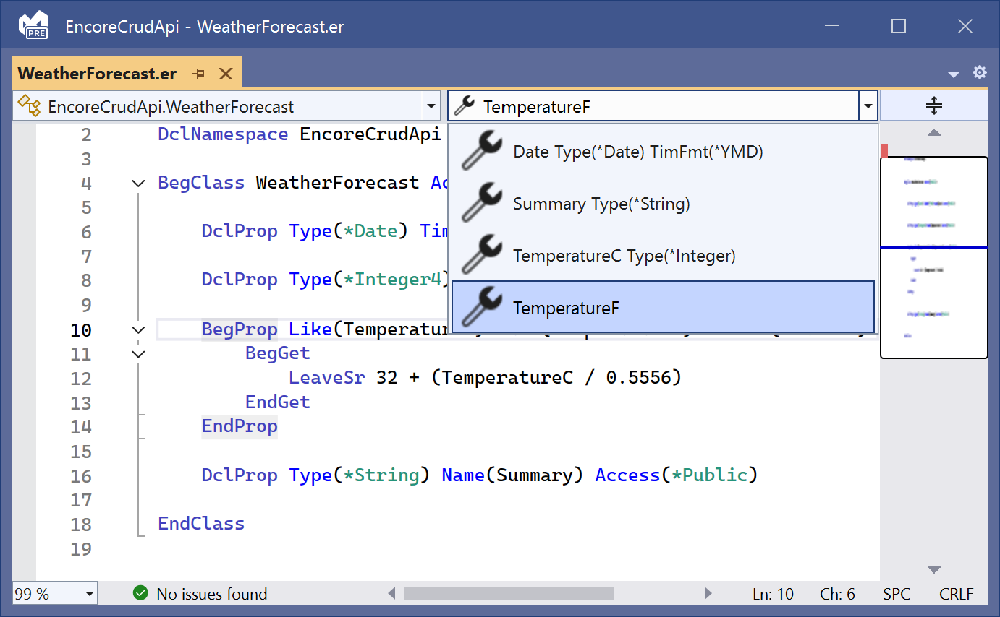
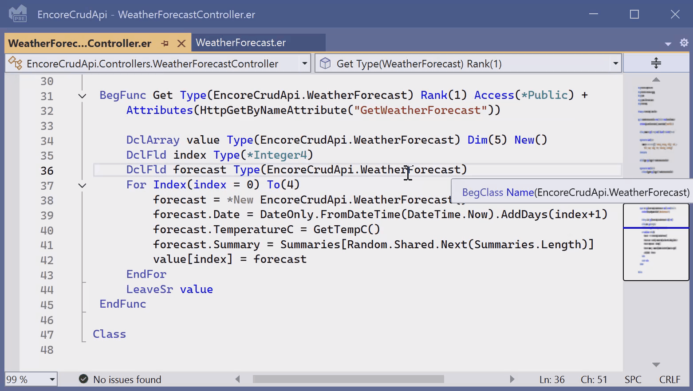

Encore RPG can also help you find and edit items in your Encore projects. Outlined below are some helpful short-cuts to quickly find a particular member or reference defined in Encore code using the language service.

> Encore editor navigation commands that move the keyboard cursor interoperate with the **Navigate Backward/Forward** command stack, accessible via Ctrl+- (backwards) and Ctrl+Shift+- (forwards), or buttons on the IDE toolbar.

* [Quick Info](#quick-info)
* [Navigation Bar](#navigation-bar)
* [Go To Definition](#go-to-definition)
* [F1 Encore Opcode Help](#f1-encore-opcode-help)

---
### Quick Info

Sometimes you just need a hint about an item in the code. This IntelliSense® feature uses the "mouse hover" gesture (or Ctrl+K, Ctrl+I keyboard shortcut) to query the language service about the selected code reference. In the editor animation below, the user cannot remember the type of the class member `Summaries`, referenced on line 41. Simply hovering the cursor over the reference reveals it to be an array of type `*String`.

> If the animation below has stopped, please [refresh the page](#quick-info).

> Font and color modifications are saved in the user's [Visual Studio settings](https://learn.microsoft.com/visualstudio/ide/personalizing-the-visual-studio-ide), and are applied only to the current theme.

> The Quick Info hover response can be enabled/disabled in **Tools\|Options** via the "Show Quick Info on hover" option. 

---
### Navigation Bar

Each Encore editor window optionally includes a simple code navigation bar in the upper margin. This UI displays and locates all class and member identities known to Encore language service in the current file.

* The left-side drop-down lists all outer classes, inner classes, interfaces, and data structures.
* The right drop-down lists the members of the current definition selected in the left drop-down.
* The selected item in the right drop-down list is the item nearest the current keyboard cursor position.
* The selected item in the left drop-down list is the member nearest the current keyboard cursor position.

An icon indicating the kind of item is shown in each list entry. The member list shown below indicates that the `WeatherForecast` class consists of four properties.

> Selecting an item in either list moves the keyboard cursor to the declaration for the item.

> The code navigator UI can be enabled/disabled in **Tools\|Options**, with the "Navigation bar" setting.

---
### Go To Definition

If an item references a code entity in any loaded Encore project, the Go To Definition command is a handy shortcut to find its declaration in the IDE. When the keyboard cursor is on the item, the default shortcut for the command is `F12`, or it can be invoked in the editor's context menu by right-clicking the item. 

The command opens the definition's file in the editor (if it is not already open), and positions the keyboard cursor on the declaration. This works for classes, interfaces, and members.

> If the animation below has stopped, please [refresh the page](#go-to-definition).

> Note: If the item's definition is not found in any currently loaded Encore project, the command cannot be invoked, and will not appear in the context menu.

---
### F1 Encore Opcode Help

Online help is available for most Encore [opcodes](/dox/ecrLrfOpCodesMain.html) and many [built-in functions](/dox/Functions_overview.html). You can access this information with the editor via `F1` when the keyboard cursor is on the item to query help for.

> Encore RPG support for `F1` help is a work-in-progress. If you find discrepancies, please contact ASNA Support.

