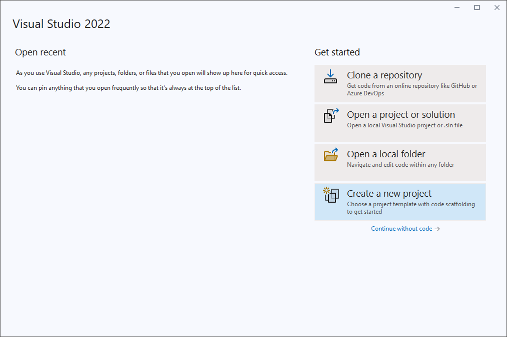
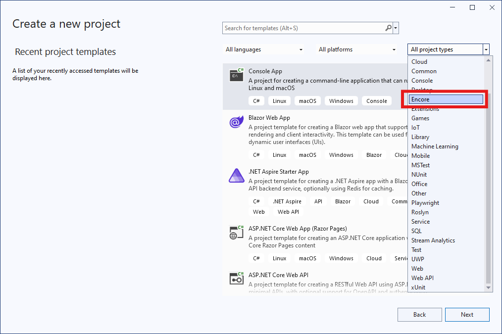
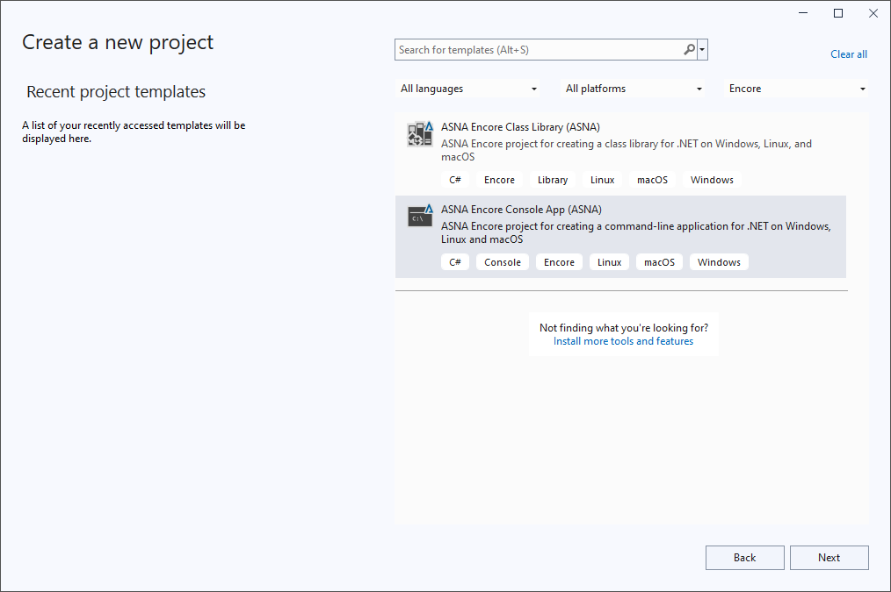
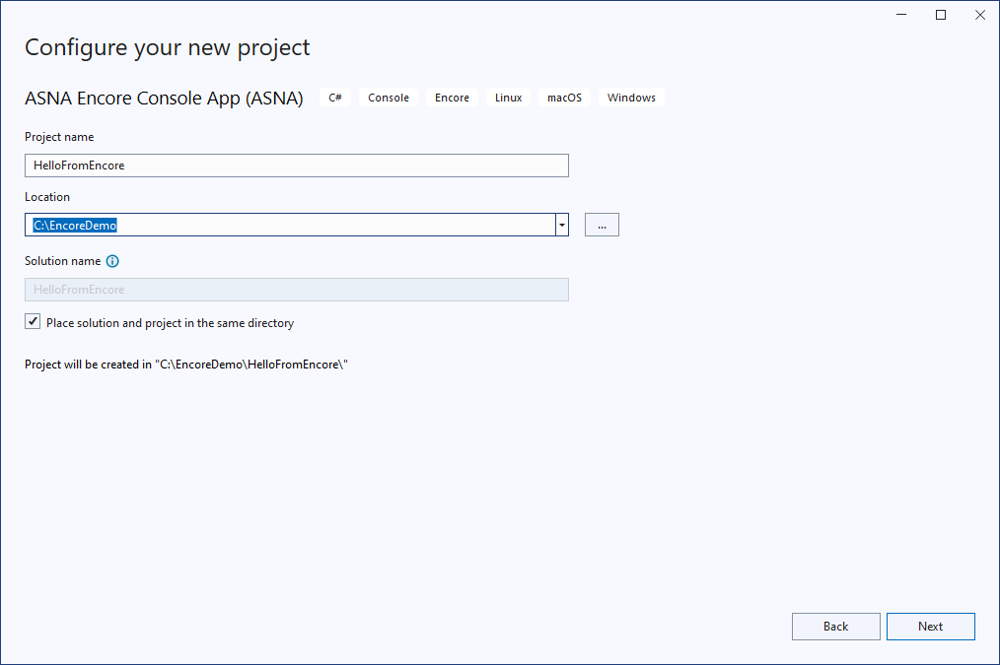
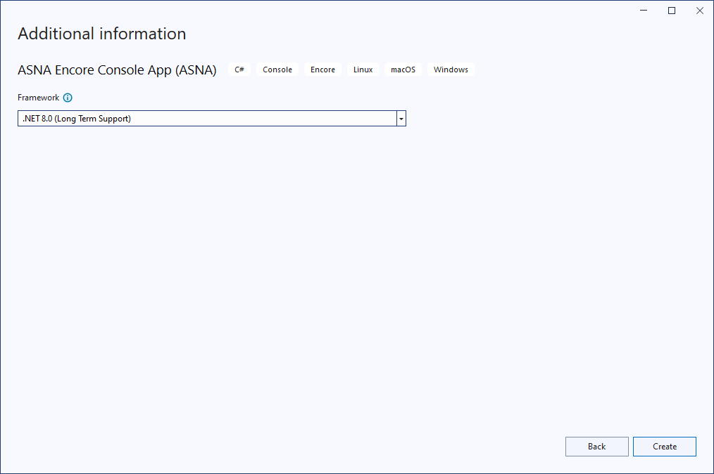

For Visual Studio veterans, development with Encore RPG is a snap. For others, it's maybe *two* snaps. This demo walks through creating the most ubiquitous and useless of all applications, Hello World, using only Encore RPG for Visual Studio.  

All new Encore users may benefit from this quick hands-on illustration of the potential of combining Encore, .NET SDK tools, and Visual Studio.

> This demo assumes Encore RPG for Visual Studio has been installed. Please review [Installation and Setup](ecrInstallationandsetup) if necessary.

* [Create the Project](#create-the-project)
* [Modify and Run the Project](#modify-and-run-the-project)

---
### Create the Project

1. Start Visual Studio, then select **Create a new project**:

    

2. From the project types drop-down list, select **Encore**:

    

3. The available Encore project types are shown. In this example, we choose **ASNA Encore Console App**, as highlighted below. Then select **Next**:

    

4. On the next page, give the project a name and location. Below, we chose `HelloFromEncore` to be the project name, and `C:\EncoreDemo` for the location. Then, select **Next**:

    

5. Finally, select the project's "target framework". Below, we chose **.NET 8**, which was the current "LTS" release for our Visual Studio version. You may select any version of .NET provided by your Visual Studio which is also supported by Encore SDK.  Then, select **Create** to generate and open the project and solution:

    

---
### Modify and Run the Project

1. After creating the project in a new Solution, Visual Studio opens the solution and displays the single Encore file the project contains (so far), `Program.er`, as show below.

    
 

2. Next, edit `Program.er` as shown below. We added an empty line below the [`DclSrParm`](DCLSRPARM) declaration in the `Main` "entry point" subroutine, then a single line to call the [`System.Console`](https://learn.microsoft.com/dotnet/api/system.console) class' [`WriteLine`](https://learn.microsoft.com/dotnet/api/system.console.writeline?view=net-9.0#system-console-writeline(system-string)) method:

    >Note that as you type in code, Encore-enabled IntelliSense suggests likely class names and language keywords for you to use. The feature settings can be modified in the **Tools\|Options** menu by entering `Text Editor Encore General` in the Search box, then selecting `General` from the tree view.

    
 

3. Now build the project and run the program. Since this is a Hello World example, we can use the [infamous](https://blog.codinghorror.com/the-f5-key-is-not-a-build-process/) `F5` key, a.k.a, **Start Debugging** on the **Debug** menu.  This command executes several Visual Studio commands in sequence (**Save All**, **Build Solution**, **Run**, and **Attach Debugger**):

    

